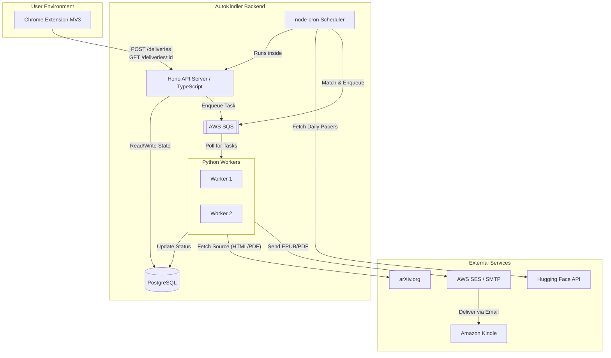

# System Architecture

## System Context
AutoKindler operates as a distributed system bridging client-side browser environments with asynchronous cloud processing. It decouples fast web requests (UI interactions, state queries) from slow, CPU-bound tasks (document downloading, HTML-to-EPUB conversion) using a message broker.

## Component Diagram

## Data Flow

### 1. Manual Delivery Flow (On-Demand)

1. **Trigger:** User clicks the extension button on a valid URL (`arxiv.org/html/*` or `*.pdf`).
2. **Request:** Extension sends `POST /api/deliveries` with the target URL and user JWT.
3. **State Initialization:** Hono API validates the request, checks the rate limit (max 5/hour), and inserts a record into the `delivery_log` table with `status: 'Pending'`.
4. **Queueing:** Hono pushes a JSON payload to AWS SQS containing the `delivery_id`, `url`, and `kindle_email`.
5. **Processing:** A Python worker pulls the message from SQS.
* If URL is PDF: Download directly.
* If URL is HTML: Download and run through `pypandoc` to generate an EPUB.

6. **Delivery:** Worker sends the file as an email attachment via SMTP (AWS SES) to the user's Kindle address.
7. **Resolution:** Worker updates the `delivery_log` status to `Completed` (or `Failed` on error) and ACKs the SQS message.
8. **Client Update:** The extension, polling `GET /api/deliveries/:id` every 15 seconds, detects the state change and triggers a browser notification.

### 2. Automated Delivery Flow (Cron)

1. **Trigger:** `node-cron` job executes at 08:00 UTC daily within the API service.
2. **Ingestion:** Fetches the top daily CS/AI papers from the Hugging Face API.
3. **Caching:** Upserts paper metadata into the `daily_papers` PostgreSQL table.
4. **Matching:** Queries active users, applies their `category_scores` JSONB preferences, and enforces the `max_papers_per_day` limit.
5. **Queueing:** For each matched user-paper pair, inserts a `Pending` record into `delivery_log` and pushes a task to SQS.
6. **Processing:** Python workers handle the SQS tasks identically to the manual flow.

## Design Principles

* **Asynchronous Isolation:** The API never handles document conversion. It only manages state and queues tasks.
* **Infrastructure Portability (Adapter Pattern):** * The Python workers interact with a generic `MessageQueue` interface, currently implemented via `boto3` for SQS, allowing easy swapping to Redis (`rq`) in the future.
* Email delivery uses standard `smtplib` rather than proprietary AWS SDKs, ensuring migration to providers like SendGrid requires only environment variable changes.

* **Ruthless Fallback Elimination:** To maintain MVP stability, the system does not attempt complex LaTeX fallback compilation. Failed HTML conversions result in a hard fail and a user notification.

## Scaling Model

* **API Layer (Hono):** Completely stateless. Scales horizontally behind a load balancer (or via serverless functions like AWS Lambda via SST).
* **Database (PostgreSQL):** Scales vertically. The `daily_papers` table is pruned every 30 days to bound storage growth. `delivery_log` enforces idempotency via unique constraints `(user_id, arxiv_id)`.
* **Worker Layer (Python):** Scales horizontally based on SQS queue depth (e.g., Target Tracking Scaling Policy). CPU/Memory limits are tuned specifically for Pandoc execution overhead.

## Failure Modes

* **Worker Crash (OOM or Timeout):** If a worker dies mid-conversion, it fails to ACK the SQS message. After the visibility timeout expires, the message returns to the queue for another worker to process.
* **Payload Size Exceeded:** AWS SES enforces a 10MB limit. Python workers evaluate file size post-conversion. If size > 9MB, the worker aborts, logs `Failed: File too large` in Postgres, and ACKs the message.
* **Conversion Failure:** Pandoc execution errors are caught, logged to `delivery_log` as a failure, and the SQS message is ACKed to prevent poison-pill loops.

## Future Architectural Extensions

* **Self-Hosted Migration:** Swap AWS SQS for Redis and AWS SES for an external SMTP provider to deploy purely on DigitalOcean App Platform or raw Droplets.
* **LaTeX Support:** Introduce a secondary, specialized worker pool (running heavier dependencies like `latexml` or TeX Live) routed via a secondary "heavy" SQS queue.
* **LLM Curation Engine:** Replace basic category matching in the cron job with an LLM evaluator (e.g., passing abstracts to Gemini/Claude) for highly personalized paper scoring.
