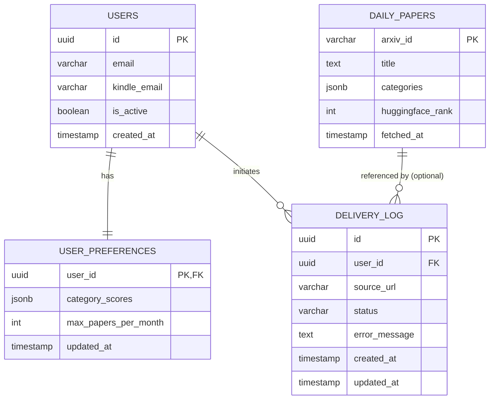

# Data Model

The AutoKindler system relies on a PostgreSQL database. It uses standard relational patterns for core entities and leverages `JSONB` for flexible scoring configurations and dynamic metadata.

## Entities and Relationships



## Key Tables

### 1. `users`

Core identity table populated via GitHub OAuth.

* **`id`** (UUID, Primary Key)
* **`email`** (VARCHAR, Unique): Primary GitHub email.
* **`kindle_email`** (VARCHAR, Unique): Target Amazon Kindle address.
* **`is_active`** (BOOLEAN): Defaults to `true`.
* **`created_at`** (TIMESTAMP)

### 2. `user_preferences`

Separated from the `users` table to isolate rapidly changing configuration data.

* **`user_id`** (UUID, Primary Key, Foreign Key to `users.id` ON DELETE CASCADE)
* **`category_scores`** (JSONB): See detailed structure below.
* **`max_papers_per_month`** (INT): Defines the quota for the automated daily cron job.
* **`updated_at`** (TIMESTAMP)

### 3. `daily_papers` (Cache)

A temporary cache populated by the daily Hugging Face API fetch. Prevents external API hammering during the matching phase.

* **`arxiv_id`** (VARCHAR, Primary Key): e.g., `2401.12345`
* **`title`** (TEXT)
* **`categories`** (JSONB): Array of category strings (e.g., `["cs.AI", "cs.LG"]`).
* **`huggingface_rank`** (INT): Rank provided by the HF API for that day.
* **`fetched_at`** (TIMESTAMP)

### 4. `delivery_log`

Tracks state for both manual and automated deliveries. Used by the API to serve polling requests from the Chrome Extension.

* **`id`** (UUID, Primary Key)
* **`user_id`** (UUID, Foreign Key to `users.id` ON DELETE CASCADE)
* **`source_url`** (VARCHAR): The arXiv HTML URL or PDF link. Acts as the paper identifier.
* **`status`** (VARCHAR): Enum `['Pending', 'Completed', 'Failed']`.
* **`error_message`** (TEXT, Nullable): Populated if status is `Failed` (e.g., "File exceeds 9MB").
* **`created_at`** (TIMESTAMP)
* **`updated_at`** (TIMESTAMP)

**Crucial Constraint:** A `UNIQUE(user_id, source_url)` constraint exists on this table to guarantee idempotency. A user cannot be sent the exact same URL twice, either manually or via cron.

## JSONB Structures

### `category_scores` (in `user_preferences`)

A key-value map representing the user's interest in specific arXiv categories on a scale of 1 to 10.

```json
{
  "cs.AI": 10,
  "cs.LG": 8,
  "cs.CV": 2
}

```

### `categories` (in `daily_papers`)

A flat array of strings representing the paper's assigned arXiv categories.

```json
[
  "cs.AI",
  "cs.LG",
  "stat.ML"
]

```

## Data Lifecycle & Retention Policies

1. **`daily_papers` Pruning:**
* **Policy:** Records older than 30 days are permanently deleted.
* **Mechanism:** A background cleanup query runs inside the daily `node-cron` job immediately after fetching the new daily papers.


2. **`delivery_log` Retention:**
* **Policy:** Kept indefinitely for the MVP.
* **Rationale:** Acts as the historical record to enforce the `UNIQUE(user_id, source_url)` constraint, ensuring the cron job never emails a user a paper they have already received (even months ago).


3. **User Deletion:**
* **Policy:** Hard delete.
* **Mechanism:** If a user deletes their account, the `ON DELETE CASCADE` constraints automatically wipe their `user_preferences` and `delivery_log` records to comply with basic data privacy standards.


