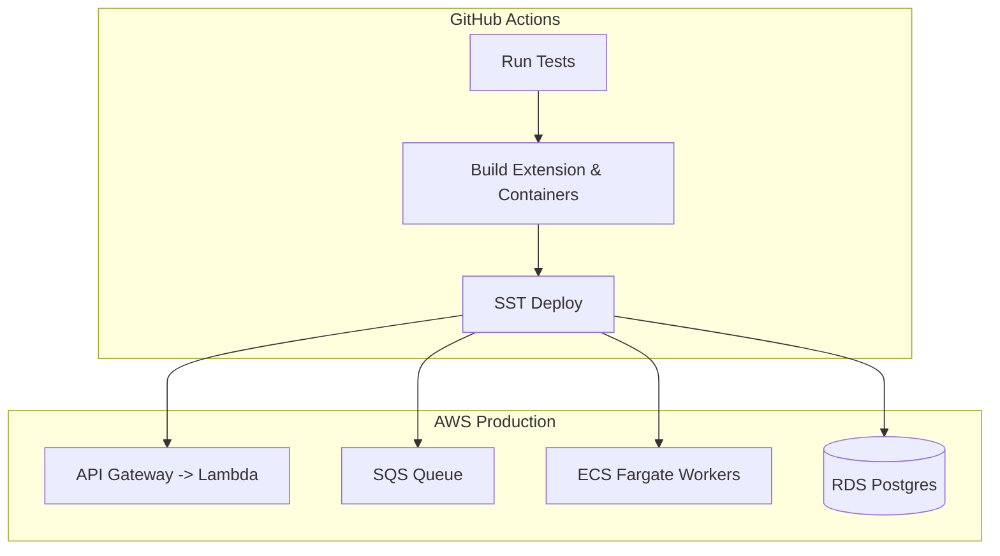

# Operations

This document outlines how the AutoKindler system is deployed, monitored, and maintained in production. 

## Environments

* **Development (`dev`):** Local machine using Docker Compose (PostgreSQL, LocalStack for SQS) and `sst dev` for live AWS resource binding.
* **Staging (`staging`):** *TODO: inferred assumption - A mirror of production used for end-to-end testing before merging to the main branch.*
* **Production (`prod`):** Live AWS environment serving actual users.

## Deployment

Infrastructure and application code are deployed simultaneously using **SST v3 (Ion)**.

### 1. Infrastructure Mapping
* **Hono API & Cron:** Deployed as an AWS Lambda function via SST's standard Node routing.
* **Python Workers:** Deployed as AWS ECS Fargate tasks using the `Dockerfile` in `apps/workers`.
* **Database:** Amazon RDS (PostgreSQL).
* **Queues & Email:** AWS SQS and AWS SES configured directly via `sst.config.ts`.

### 2. Deployment Process
Deployments are handled via standard SST CLI commands.
*TODO: inferred assumption - CI/CD pipeline runs these commands automatically on merge to `main`.*

```bash
# Deploy to production
npx sst deploy --stage prod

```



## Queue Management

AWS SQS decouples the API from the Python workers.

* **Visibility Timeout:** Set to 5 minutes to allow `pypandoc` sufficient time to process large HTML files before the message is returned to the queue.
* **Dead Letter Queue (DLQ):** *TODO: inferred assumption - Messages that fail to process 3 times (e.g., worker continually crashes on a specific payload) are routed to a DLQ to prevent infinite retry loops.*

## Monitoring & Logs

For the MVP, we rely entirely on native AWS tooling rather than third-party observability platforms.

### 1. Logs

* **API Logs:** Hono request logs are automatically routed to AWS CloudWatch Logs under the Lambda function's log group.
* **Worker Logs:** Python standard output (`print()` and `logging` module) is routed to CloudWatch Logs under the ECS task's log group.

### 2. Monitoring (CloudWatch Metrics)

Key metrics to monitor:

* **SQS `ApproximateNumberOfMessagesVisible`:** Indicates if workers are keeping up with the API/Cron job. If this spikes continuously, ECS tasks must scale out.
* **Lambda `Errors` & `Duration`:** Tracks API health.
* **SES `BounceRate`:** Critical. If this exceeds 5%, AWS may suspend the SES account. Ensure users are strictly onboarding with valid Kindle addresses.

## Debugging Deliveries

When a user reports a failed delivery, follow this runbook:

1. **Query Postgres State:**
Find the delivery attempt in the database.
```sql
SELECT id, status, error_message, updated_at 
FROM delivery_log 
WHERE user_id = 'user-uuid' AND source_url LIKE '%1234.5678%';

```


2. **Check the Status:**
* If `Pending` for > 10 minutes: The SQS queue is backed up, or workers are offline.
* If `Failed`: Read the `error_message` column (e.g., "File exceeds 9MB limit").


3. **Trace in CloudWatch:**
If the database error message lacks context, take the `id` from the SQL query and search the ECS Worker CloudWatch log group for that specific UUID to view the raw Python traceback.
