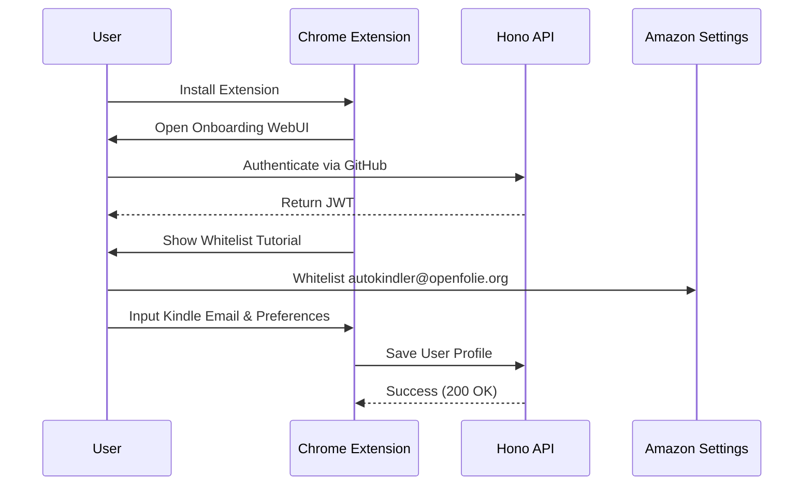

# Product Specification

## Problem Statement
Reading complex academic papers on backlit monitors induces eye strain and fatigue. While e-ink displays (like the Amazon Kindle) offer a superior reading experience, the workflow to transfer papers from discovery (arXiv via browser) to the device is highly manual and disruptive to research workflows. 

## User Personas

### 1. The Machine Learning Practitioner
* **Needs:** To stay updated with the firehose of daily AI/ML research without actively hunting for papers.
* **Usage Pattern:** Sets up an automated subscription for `cs.LG` and `cs.AI` categories, receiving their top 2 allocated papers automatically every morning.

### 2. The Academic Researcher (Graduate Student)
* **Needs:** To quickly send specific, ad-hoc papers to their e-reader while conducting literature reviews.
* **Usage Pattern:** Browses arXiv. When finding a relevant paper, clicks the Chrome extension to queue it for immediate delivery without breaking their browsing context.

## User Flows

### 1. Onboarding Flow
1. User installs the Chrome Extension.
2. Extension automatically opens a local WebUI (React page bundled in the extension).
3. User clicks "Sign in with GitHub" (OAuth handled by Hono API).
4. WebUI displays a short tutorial (Video/GIF) demonstrating:
   * How to locate their `@kindle.com` email address.
   * How to whitelist the system's sender address (`autokindler@openfolie.org`) in Amazon preferences.
5. User inputs their Kindle email and selects their daily/monthly paper quotas and category preferences (e.g., AI, Computer Vision).
6. Data is saved to the backend; onboarding completes.

### 2. Manual Delivery Flow (Ad-Hoc)

1. User navigates to an arXiv HTML page (`arxiv.org/html/1234.5678v1`) or a `.pdf` URL.
2. The AutoKindler extension icon becomes active.
3. User clicks the extension icon. A popup appears displaying the paper title and a "Send to Kindle" button.
4. User clicks "Send". UI changes to a `Pending` state.
5. Extension polls the API every 15 seconds.
6. Upon completion, extension displays a native Chrome Desktop Notification: "Paper delivered successfully."

## Feature Specifications

### 1. The Chrome Extension

* **Activation Rules:** Only active when `window.location.href` matches `arxiv.org/html/*` or `*.pdf`.
* **State Management:** Uses HTTP polling instead of WebSockets to comply with Chrome Manifest V3 service worker lifecycle constraints.
* **UI States:** `Idle` (ready to send), `Pending` (queued or processing), `Completed` (success), `Failed` (with error reason).

### 2. The Conversion Engine (MVP)

* **PDF Pass-Through:** If the source URL is a PDF, the worker downloads it and emails it directly. No formatting alterations are made.
* **HTML to EPUB:** If the source URL is an arXiv HTML page, the worker downloads the HTML asset and uses `pypandoc` to convert it to an EPUB format optimized for reflowable e-ink screens.
* **LaTeX Ignore:** `.tex` source files are explicitly ignored in version 1.0.

### 3. Automated Subscriptions (Cron)

* **Source:** Hugging Face Daily Papers API (CS/AI categories only).
* **Schedule:** Executes daily at 08:00 UTC.
* **Allocation Logic:** * Checks user's monthly quota (e.g., 10 papers/month).
* If quota is not exhausted, cross-references daily HF papers with the user's `category_scores` preferences.
* Selects the top matching paper(s) up to the user's daily limit.
* Dispatches to the SQS queue.

## Edge Cases

1. **File Too Large (SES 10MB Limit):** * *Scenario:* A PDF or compiled EPUB with numerous high-res images exceeds 9MB.
* *Handling:* Python worker hard-fails the task. Database state is updated to `Failed: File exceeds 9MB limit`. Extension notifies the user.

2. **Pandoc Conversion Failure:**
* *Scenario:* Anomalous HTML structure causes `pypandoc` to crash.
* *Handling:* Worker catches the exception, updates state to `Failed: Unconvertible Source`, and drops the task. No infinite retry loop.

3. **Duplicate Delivery Attempt:**
* *Scenario:* User clicks "Send" twice rapidly, or cron job runs twice.
* *Handling:* The Postgres `delivery_log` table enforces idempotency via a unique constraint on `(user_id, arxiv_id)`. The second API request is rejected with a `409 Conflict`.

4. **Amazon Rejection (Not Whitelisted):**
* *Scenario:* User forgot to whitelist `autokindler@openfolie.org`.
* *Handling:* AWS SES reports successful dispatch, but Amazon silently drops it. This is a known UX trade-off. We rely on the onboarding tutorial to prevent this.

## Limits and Quotas

* **Manual Send Rate Limit:** 5 requests per hour, per user. Enforced at the Hono API level via Redis or simple in-memory cache.
* **Attachment Size Limit:** 9MB hard limit enforced by the worker prior to SMTP transmission.
* **Automated Subscription Limits:** Defined by the user during onboarding (e.g., Max 1 paper per day, Max 15 papers per month). Enforced by the `node-cron` scheduling query.
